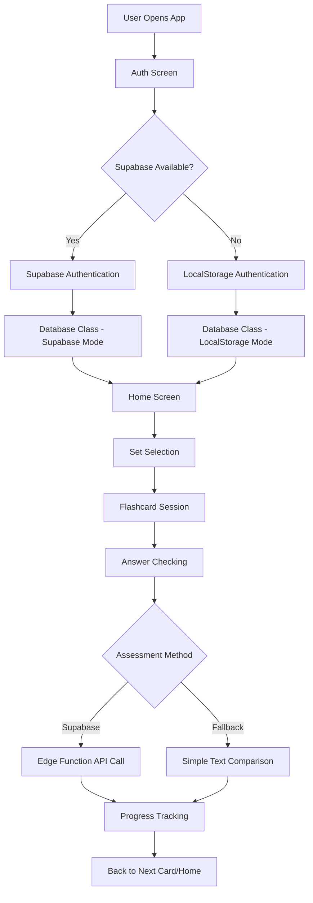

# Brothers Karamazov Flashcard App - Architecture

## High-Level Architecture Flow



## Detailed Component Architecture

### 1. Authentication System
**Variables/Objects:**
- `currentUser` - stores authenticated username
- `supabase` - Supabase client instance
- `SUPABASE_URL`, `SUPABASE_ANON_KEY` - configuration constants

**Flow:**
```
handleAuth() → Database.signIn()/saveAccount() → showHome()
```

### 2. Database Abstraction Layer
**Class:** `Database`
**Key Methods:**
- `init()` - initializes Supabase or localStorage
- `syncFlashcards()` - syncs mock data to Supabase
- `getUserProgress()` - retrieves user's study progress
- `saveUserProgress()` - persists progress updates

**Dual Mode Operation:**
- **Supabase Mode:** Uses real database with `supabase.from('table')`
- **Fallback Mode:** Uses `localStorage` for persistence

### 3. Flashcard Data Management
**Data Sources:**
- `mockData` object containing card sets:
  ```javascript
  mockData = {
    chain: [...], // Brothers Karamazov character/plot cards
    chapters: [...] // Chapter summary cards
  }
  ```

**Session State Variables:**
- `currentSet` - active flashcard set ('chain' or 'chapters')
- `currentCards` - array of cards for current session
- `cardOrder` - array of indices for card presentation order
- `currentCardIndex` - current position in card order

### 4. Study Session Management
**Core Variables:**
- `sessionStats` object:
  ```javascript
  {
    seen: new Set(),     // card indices user has viewed
    correct: new Set(),  // card indices answered correctly
    wrong: new Set()     // card indices answered incorrectly
  }
  ```

**Study Modes:**
- `mode` - 'random' or 'sequential' card presentation
- Controlled by `setMode()`, `initializeCardOrder()`

### 5. Answer Assessment System
**Primary Method:** `checkAnswer()`
**Assessment Flow:**
1. **Supabase Edge Function** (`supabase/functions/check-answer/index.ts`):
   - Calls Anthropic API for intelligent assessment
   - Returns structured feedback: `{result, feedback}`
   
2. **Fallback Method** (`simpleAssessment()`):
   - Basic string comparison and keyword matching
   - Used when Supabase unavailable

**Assessment Results:**
- `correct` - full credit
- `partial` - partial understanding detected
- `incorrect` - wrong answer

### 6. Progress Persistence
**Supabase Tables:**
- `flashcard_sets` - set metadata
- `flashcards` - individual cards
- `user_progress` - user performance tracking

**LocalStorage Structure:**
```javascript
accounts = { username: password }
userProgress = { 
  username: {
    setId: { correct: [], seen: [] }
  }
}
```

### 7. UI State Management
**Screen States:**
- `authScreen` - login/signup form
- `homeScreen` - set selection and overall progress
- `flashcardScreen` - study session interface

**Dynamic Elements:**
- `flashcard` - 3D flip animation container
- `cardFront`/`cardBack` - question/answer display
- `feedback` - assessment result display
- `progressStats` - real-time session statistics

## Data Flow Examples

### Study Session Initialization
```
startSet('chain') → 
  currentCards = mockData.chain → 
  load sessionStats from db.getUserProgress() → 
  initializeCardOrder() → 
  showNextCard()
```

### Answer Processing
```
checkAnswer() → 
  supabase.functions.invoke('check-answer') → 
  handleAssessmentResult() → 
  update sessionStats → 
  db.saveUserProgress() → 
  setTimeout(showNextCard, 3000)
```

### Progress Synchronization
```
Periodic: sessionStats → db.saveUserProgress() → Supabase/localStorage
On Exit: backToHome() → save final progress → showHome()
```

## Key Design Patterns

1. **Graceful Degradation:** Supabase → localStorage fallback
2. **Progressive Enhancement:** Simple assessment → AI-powered evaluation
3. **State Persistence:** Session stats saved every 5 cards and on exit
4. **Responsive UI:** Loading states, animations, keyboard shortcuts
5. **Modular Architecture:** Database abstraction allows multiple backends

## File References
- **Main App:** `flashcard-app.html:1-940`
- **Edge Function:** `supabase/functions/check-answer/index.ts:1-119`
- **Database Schema:** `supabase/migrations/001_initial_schema.sql`
- **Card Data:** Embedded in `mockData` object (`flashcard-app.html:338-353`)